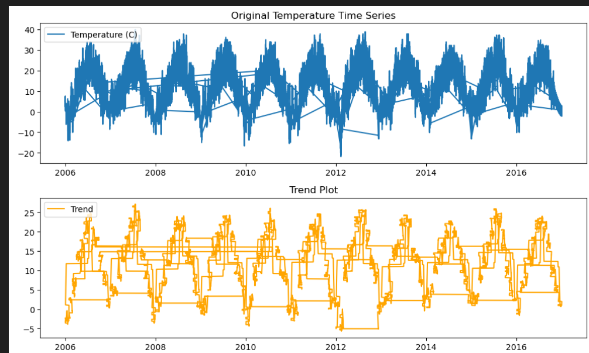
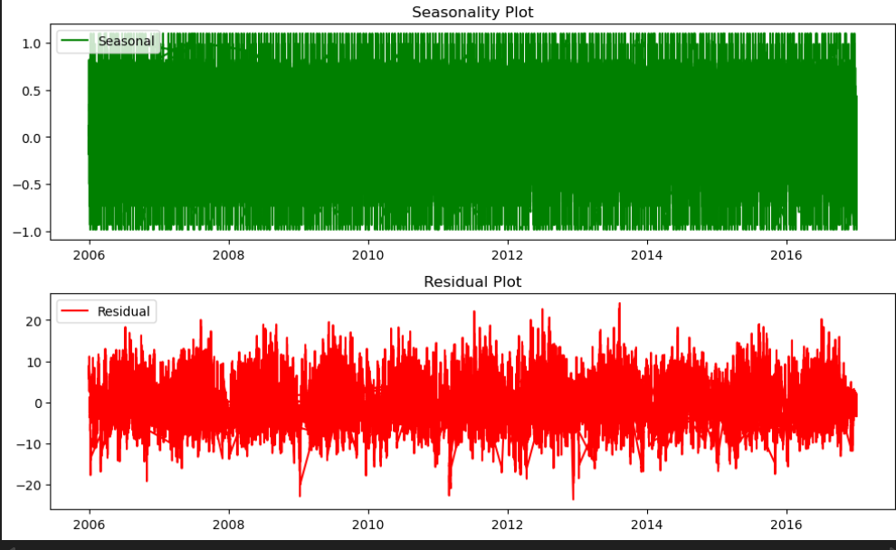

# Ex.No: 05  IMPLEMENTATION OF TIME SERIES ANALYSIS AND DECOMPOSITION

### Date: 22-09-2025

---

### AIM:

To illustrate how to perform time series analysis and decomposition on the monthly average temperature of a city/country and for airline passengers.

---

### ALGORITHM:

1. Import the required packages like `pandas`, `matplotlib`, and `statsmodels`.
2. Read the dataset using `pandas`.
3. Convert the date column to datetime format and set it as the index.
4. Drop any missing values for the target variable (temperature).
5. Perform seasonal decomposition on the time series using `seasonal_decompose`.
6. Plot the original series, trend, seasonal, and residual components.
7. Display the overall results.

---

### PROGRAM:

```python
import pandas as pd
import matplotlib.pyplot as plt
from statsmodels.tsa.seasonal import seasonal_decompose

# Step 1: Load dataset and parse date
df = pd.read_csv("weatherHistory.csv")
df['Formatted Date'] = pd.to_datetime(df['Formatted Date'], utc=True, errors='coerce')

# Step 2: Set datetime as index
df = df.set_index('Formatted Date')

# Step 3: Drop missing temperature values
df = df.dropna(subset=['Temperature (C)'])

# Step 4: Perform seasonal decomposition
# Daily data, approximate yearly seasonality: period=365
decomposition = seasonal_decompose(df['Temperature (C)'], model='additive', period=365)

# Step 5: Plot decomposition
plt.figure(figsize=(10, 12))

# Original Time Series
plt.subplot(411)
plt.plot(df['Temperature (C)'], label='Temperature (C)')
plt.legend(loc='upper left')
plt.title('Original Temperature Time Series')

# Trend
plt.subplot(412)
plt.plot(decomposition.trend, label='Trend', color='orange')
plt.legend(loc='upper left')
plt.title('Trend Plot')

# Seasonal
plt.subplot(413)
plt.plot(decomposition.seasonal, label='Seasonal', color='green')
plt.legend(loc='upper left')
plt.title('Seasonality Plot')

# Residual
plt.subplot(414)
plt.plot(decomposition.resid, label='Residual', color='red')
plt.legend(loc='upper left')
plt.title('Residual Plot')

plt.tight_layout()
plt.show()
```

---

### OUTPUT:

**FIRST FIVE ROWS:**

```python
print(df.head())
```

---

**PLOTTING THE DATA:**
The original temperature data over time is plotted to visualize variations and trends.

**OVERALL REPRESENTATION:**





---

### RESULT:

Thus, we have successfully implemented Python code for time series analysis and decomposition, and visualized the original, trend, seasonal, and residual components of the temperature dataset.

